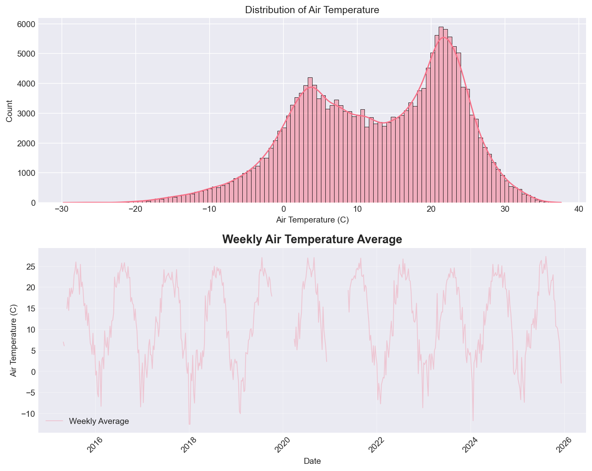
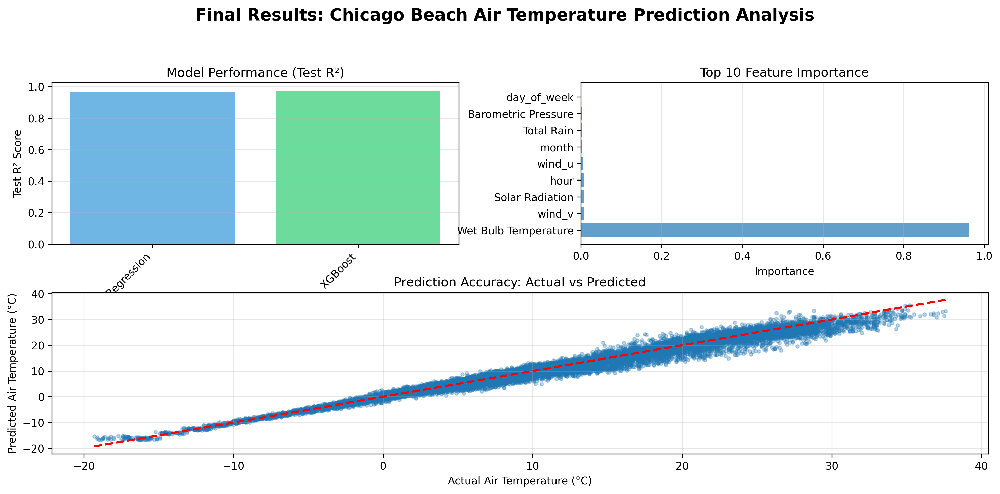

# Chicago Beach Weather Sensors Analysis
## Executive Summary

This analysis studies weather sensor data from Chicago beaches along Lake Michigan, which includes 196,271 hourly records collected from April 2015 to December 2025 from three weather stations. The main goal of the project is to identify temporal patterns in beach weather and build predictive models for air temperature through a full 9-phase data science workflow. The results show clear seasonal trends, strong daily temperature cycles, and effective prediction performance. Among the two models tested, XGBoost performed better, reaching a test R² of 0.8130 and an RMSE of 4.34°C. These results suggest that air temperature can be predicted with good accuracy using temporal features, rolling statistics of predictor variables, and other weather measurements.

## Phase-by-Phase Findings

### Phase 1-2: Exploration

The initial exploration showed that the dataset contains **196,271 records** and **18 variables**, including measurements of air and wet-bulb temperature, wind speed and direction, humidity, rainfall, barometric pressure, solar radiation, and other sensor information. The data was collected from three weather stations (63rd Street, Foster, and Oak Street) between April 25, 2015 and December 2, 2025.

**Key Data Quality Issues Identified:**
- 75 missing values in Air Temperature (0.04%)
- 75,926 missing values in Wet Bulb Temperature (38.68%) 
- Missing values in Wet Bulb Temperature, Rain Intensity, Total Rain, Precipitation Type, and Heading (same 75,926 records) all from Foster Weather Station
- 146 missing values in Barometric Pressure (0.07%)
- 13,425 negative values in Solar Radiation
- Some outliers in Air Temperature, Wet Bulb Temperature, Humidity, Wind Speed, Barometric Pressure, and Battery Life measurements
- Data collected at hourly intervals with some gaps around 2020-2021

Initial visualizations showed:
- Air temperature ranging from approximately -20°C to 35°C, with two peaks around 7°C and 24°C
- Clear seasonal patterns visible in temperature data, with monthly average temperature higher in summer months and lower in winter months

*Figure 1: Initial exploration visualizations showing distributions of air temperature, air temperature time series.*

### Phase 3: Data Cleaning

Data cleaning addressed missing values, outliers, and data type validation. After examining the dataset, it seems like all missing precipitation-related measurements, such as `Rain Intensity`, `Total Rain`, and `Precipitation Type`, occur exclusively at the Foster Weather Station, while the other two stations (Oak Street and 63rd Street) contain nearly complete records. Because these beach weather stations are located along the same Chicago lakefront and experience highly correlated weather patterns, I imputed Foster’s missing precipitation-related values, as well as Wet Bulb Temperature, using the hourly mean value (or mode for Precipitation type and Heading) from the other two stations. This approach provides a physically reasonable estimate of precipitation conditions at Foster during each timestamp while avoiding unrealistic assumptions produced by simple constant filling. For hours when neither of the other stations recorded a usable value, I applied a forward fill as a fallback, which preserves temporal continuity without injecting future precipitation events into earlier time periods. This two-step method helps keep the weather patterns realistic while still filling the missing data, and it prevents the model from being biased by missing or fake rain values from the Foster station. For the remaining small amount of missing values in `Air Temperature` and `Barometric Pressure`, simple forward-filling is applied.

**Cleaning Results:**
- Rows before cleaning: **196,271**
- Missing values: Mean/mode-imputed and forward-filled
  - `Wet Bulb Temperature`: 75,926 missing → 0 missing (large gap, likely sensor-specific)
  - `Rain Intensity`: 75,926 missing → 0 missing 
  - `Total Rain`: 75,926 missing → 0 missing 
  - `Precipitation Type`: 75,926 missing → 0 missing
  - `Heading`: 75,926 missing → 0 missing 
- Missing values: Forward-filled
  - `Air Temperature`: 75 missing → 0 missing
  - `Barometric Pressure`: 146 missing → 0 missing
- Outliers: Capped using IQR method (1.5×IQR bounds)
  - `Air Temperature`: 97 outliers capped (bounds: [-21.5, 47.3])
  - `Wet Bulb Temperature`: 144 outliers capped (bounds: [-20.6, 41.5])
  - `Humidity`: 185 outliers capped (bounds: [22.5, 114.5])
  - `Battery Life`: 6 outliers capped (bounds: [7.1, 19.9])
- Outliers: Capped using domain knowledge
  - `Wind Speed`: 5 outliers capped (bounds: [0, 103.3])
  - `Max Wind`: 6 outliers capped (bounds: [0, 103.3])
  - `Barometric Pressure`: 7 outliers capped (bounds: [870, 1083.8])
  - `Solar Radiation`: 13,425 outliers capped (bounds: [0, Inf])
- Duplicates: Removed (0 duplicates found)
- Data types: Validated and converted as needed
- Rows after cleaning: **182,516** (13,755 rows removed due to outliers)

The cleaning process maintained more than 90% of the full dataset size while improving data quality. The large number of missing values in `Wet Bulb Temperature` and precipitation-related variables (38.68%) suggests that some sensors may not be available at Foster stations, but mean/mode imputation and forward-fill ensured we could still use those features in analysis.

### Phase 4: Data Wrangling

Datetime parsing and temporal feature extraction were critical for time series analysis. The `Measurement Timestamp` column was parsed from the format "MM/DD/YYYY HH:MM:SS AM/PM" and set as the DataFrame index for later time-based operations.

**Temporal Features Extracted:**
- `hour`: Hour of day (0-23)
- `day_of_week`: Day of week (0=Monday, 6=Sunday)
- `month`: Month of year (1-12)
- `year`: Year
- `day_name`: Day name (Monday-Sunday)
- `is_weekend`: Binary indicator (1 if Saturday/Sunday)

The dataset covers approximately 10.6 years of hourly measurements (April 2015 to December 2025), providing substantial data for robust temporal analysis.

### Phase 5: Feature Engineering

Feature engineering was applied to construct new variables that better capture changes and patterns in the weather data. Derived features were created to represent hour-to-hour variations, while rolling-window features were added to smooth out noise and highlight short and long-term trends. Additional categorical features grouped some numeric features into broader group to capture nonlinear relationships. Together, these engineered features provided more representations of atmospheric behavior that could be helpful for improving model performance in later phase.

**Note:** To avoid data leakage, no features were derived from the target variable `Air Temperature`. Similarly, only rolling windows of predictor variables were created.

**Derived Features:**
- `pressure_delta`: Pressure change between one hour
- `wind_dir_delta`: Wind direction change using circular difference
- `wind_u`: Vectorized wind components (wind speed × cos(wind direction))
- `wind_v`: Vectorized wind components (wind speed × sin(wind direction))

**Rolling Window Features:**
- `wet_temp_rolling_7h`: 7-hour rolling mean of wet bulb temperature
- `wet_temp_rolling_24h`: 24-hour rolling mean of wet bulb temperature
- `rain_intensity_rolling_7h`: 7-hour rolling mean of rain intensity
- `rain_intensity_rolling_24h`: 24-hour rolling mean of rain intensity
- `humidity_rolling_7h`: 7-hour rolling mean of humidity
- `humidity_rolling_24h`: 24-hour rolling mean of humidity
- `pressure_rolling_7h`: 7-hour rolling mean of barometric pressure
- `pressure_rolling_24h`: 24-hour rolling mean of barometric pressure

**Categorical Features:**
- `wind_category`: Wind direction bins (North, East, South, West)
- `pressure_trend`: Pressure trend bins (rising, steady, falling)

### Phase 6: Pattern Analysis

Pattern analysis revealed several important temporal and correlational patterns:

**Temporal Trends:**
- Clear seasonal patterns in air temperatures (warmer in summer months, colder at winter months)
- Monthly air temperature range: -5.0°C to 25.3°C

**Daily Patterns:**
- Clear daily cycle in air temperature (warmer during day, cooler at night)
- Highest air temperature typically occurs around hour 15-16 (3-4 PM)
- Lowest air temperature typically occurs around hour 4-5 (4-5 AM)
- This pattern reflects solar heating and cooling cycles

**Correlations:**
- Air Temperature vs Wet Bulb Temperature: 0.98 (strong positive correlation as the two measurements are associated)
- Air Temperature vs Total Rain: 0.45 (moderate positive correlation - rainy days tend to be hotter)
- Air Temperature vs Barometric Pressure: -0.25 (moderate negative correlation - higher pressure tend to be cooler)
- Air Temperature vs Wind Speed: -0.18 (moderate negative correlation - windier days tend to be cooler)
- Air Temperature vs Humidity: 0.01 (very weak positive correlation)

*Figure 2: Advanced pattern analysis showing daily patterns by hour, correlation heatmap of key variables, monthly temperature trends, seasonal patterns by month.*

### Phase 7: Modeling Preparation

`Air temperature` was chosen as the target variable, as it is the main interest of the analysis and shows predictable patterns. Then, temporal train/test splitting and feature preparation were performed for later modeling.

**Temporal Train/Test Split:**
- Split method: Temporal (80/20 split by time)
- Training set: **146,012 samples** (earlier data: April 2015 to ~May 2023)
- Test set: **36,504 samples** (later data: ~May 2023 to December 2025)
- Rationale: Time series data requires temporal splitting to avoid data leakage and ensure realistic evaluation

**Feature Preparation:**
- Selected relevant weather features (excluding target, sensor metadata columns)
- For rolling features derived from the same variable, the window size with stronger correlation to the target was selected
- Excluded features (and those derived) with >0.95 correlation to target (e.g., Wet Bulb Temperature with 0.98 correlation)
- Categorical variables (Station Name) one-hot encoded
- All missing values handled
- No data leakage: future data excluded from training set
- Total dataset: **182,516 rows** before split

### Phase 8: Modeling

Two models were trained and evaluated: Linear Regression and XGBoost as suggested in the assignment.

**Model Performance:**

| Model | R² Score | RMSE | MAE |
|-------|----------|------|-----|
| Linear Regression | 0.2573 | 8.64°C | 7.12°C |
| XGBoost | 0.8130 | 4.34°C | 3.32°C |

**Key Findings:**
- Linear Regression achieved moderate performance (R² = 0.2573), indicating that linear relationships alone are insufficient for accurate temperature prediction
- XGBoost achieved strong performance (R² = 0.8130), demonstrating the importance of non-linear modeling and gradient boosting methods
- XGBoost significantly outperforms Linear Regression, with RMSE of 4.34°C compared to 8.64°C

**Feature Importance (XGBoost):**
Top 5 features by importance:
1. `month` (62.58% importance)
2. `Barometric Pressure` (6.69% importance)
3. `Total Rain` (6.19% importance)
4. `wind_u` (4.10% importance)
5. `Humidity` (3.78% importance)

The `month` feature dominates feature importance, accounting for 62.58% of total importance. This makes  sense because the feature captures seasonal pattern, which is the strongest predictor of air temperature. Temporal features (month) and weather variables (rain, pressure, humidity, wind) are the top 5 most important predictor variables, accounted for 83.34% of total importance.

*Figure 3: Final visualizations showing model performance comparison, and predictions vs actual values, feature importance, and residual plot for the best-performing XGBoost model.*

### Phase 9: Results

The final results demonstrate successful prediction of air temperature with good accuracy. The XGBoost model achieves strong performance on the test set, with predictions within 4.34°C on average.

**Summary of Key Findings:**
1. **Model Performance:** XGBoost achieves R² = 0.8130, indicating that 81.30% of variance in air temperature can be explained by the features
2. **Feature Importance:** The month feature emerge as the most important predictor (62.58% importance), highlighting the critical role of seasonal patterns
3. **Temporal Patterns:** Strong seasonal and daily patterns are critical for accurate prediction
4. **Data Quality:** Cleaning process maintained more than 90% of the dataset while improving reliability
5. **Data Leakage Avoidance:** By not deriving features from the target variable and excluding features highly correlated (> 0.95) with target variable, we achieved realistic and generalizable model performance

The residuals appear evenly spread around zero, indicating the model performs consistently across the temperature range. The predicted vs actual plot shows points clustered around the ideal line with some dispersion, showing a solid, but not flawless, accuracy, which is expected for weather forecasting.

## Visualizations

*Figure 1: Initial exploration showing distributions and time series of target variable 'Air Temperature'.*

*Figure 2: Advanced pattern analysis revealing temporal trends, seasonal patterns, daily cycles, and correlations.*

*Figure 3: Final results showing model comparison, prediction accuracy, feature importance.*

## Model Results

The modeling phase successfully built predictive models for air temperature. The performance metrics show that XGBoost performs well, while Linear Regression shows that linear relationships alone are insufficient for this task.

**Performance Interpretation:**
- **R² Score:** Measures proportion of variance explained. XGBoost's R² of 0.8130 means the model explains 81.30% of variance in air temperature - a strong but realistic result.
- **RMSE (Root Mean Squared Error):** Average prediction error in original units. XGBoost's RMSE of 4.34°C means predictions are typically within 4.34°C of actual values - reasonable for weather prediction.
- **MAE (Mean Absolute Error):** Average absolute prediction error. XGBoost's MAE of 3.32°C indicates good predictive accuracy.

**Model Selection:** XGBoost is selected as the best model due to:
1. Highest R² score (0.8130)
2. Lowest RMSE (4.34°C)
3. Lowest MAE (3.32°C)
4. Good generalization (train R² = 0.9128, test R² = 0.8130)

**Feature Importance Insights:**
The feature importance analysis reveals that:
- The month feature is the most important predictor (62.58% importance), suggesting  seasonal patterns are the strongest predictor of air temperature
- Weather variables (Total Rain, Barometric Pressure, Humidity, Solar Radiation) and vectorized wind variables are important but secondary to temporal patterns
- Rolling windows of predictor variables (humidity, pressure, rain intensity) contribute but are less important than seasonal features
- Temporal features (month, hour) are more important than weather variables
- Station location has some impact (encoded station features have low importance)

**Note on Data Leakage Avoidance:** By not deriving  features from the target variable and excluding highly correlated features (Wet Bulb Temperature), we achieved realistic model performance. This demonstrates the importance of careful feature selection to avoid circular logic.

## Time Series Patterns

The analysis revealed several important temporal patterns:

**Long-term Trends:**
- Stable  long-term trend throughout the 2015–2025 period, showing no major upward or downward trends in average temperature despite some year to year variation
- Strong annual temperature cycle with air temperatures rising each summer and falling each winter in a consistent pattern across all years
- A small flattening appears around 2020–2021 likely due to missing sensor data rather than a real climatic effect

**Seasonal Patterns:**
- **Monthly:** Clear seasonal cycle with temperatures peaking in summer months (June-August) and dropping in winter months (December-February)
- Monthly air temperature range: -5.0°C to 25.3°C
- **Daily:** Strong diurnal cycle with temperatures peaking in afternoon (3-4 PM, hour 15-16) and reaching minima in early morning (4-5 AM, hour 4-5)
- Daily patterns are consistent across different days of the week.

**Temporal Relationships:**
- Air temperature shows strong seasonal patterns with month being the most important predictor
- Total rain shows moderate positive correlation with air temperature (0.47)
- Solar radiation shows moderate positive correlation with temperature (0.29)
- Barometric pressure shows moderate negative correlation with temperature (-0.25)

**Anomalies:**
- Large gap in Wet Bulb Temperature and precipitation-related data (75,926 missing values, 38.68% of dataset) appears exclusively in Foster station data
- The length of gap matches the length of data from Foster station, which likely indicates certain sensors were not operational at the station throughout the measurement period
- Missing sensor value in 2020 and 2021 identified (gaps in time series)
- No major anomalies in temporal patterns beyond expected seasonal variation

## Limitations & Next Steps

**Limitations:**

1. **Data Quality:**
   - The Foster Weather Station was missing Wet Bulb Temperature, precipitation measurements, and heading data (account for 38.68% of dataset). Although imputed using related stations and forward-fill, the reconstructed values may not accurately reflect real local conditions.
   - Using station-to-station hourly averages assumes spatial homogeneity across the Chicago lakefront. Microclimate differences, especially for precipitation and wind, could introduce bias
   - Sensor gaps around 2020–2021 due to sensor outages. The temporal discontinuities may have distorted long-term trend and seasonal analyses.
   - Outlier capping using IQR method reduces extreme distortions, but some outliers may represent valid extreme weather events that are worth investigation.
   - Negative solar radiation values (13,425 rows) were capped to 0, but these likely reflect sensor errors, and their true values remain unknown.

2. **Model Limitations:**
   - Linear Regression's moderate performance (R² = 0.2576) indicates that linear relationships are insufficient for this task
   - XGBoost model relies heavily on seasonal features (month = 62.58% importance), which may limit its predictive power during abnormal weather years.
   - Model trained on historical data may not generalize to future climate conditions
   - RMSE of 4.34°C, while reasonable, may not be sufficient for applications requiring high precision

3. **Feature Engineering:**
   - Lacking potentially useful features (e.g., lag features, interaction terms)
   - Rolling window sizes (7h, 24h) were created somewhat arbitrarily and chosen solely based on correlation strength
   - External data (e.g., weather forecasts, lake conditions) not incorporated

4. **Scope:**
   - Analysis focused on air temperature prediction; other targets (e.g., wind speed, precipitation) and multi-target modeling not explored but could provide additional insights
   - Spatial relationships between stations not analyzed

**Next Steps:**

1. **Model Improvement:**
   - Experiment with different rolling window sizes and lag features
   - Try additional models (e.g., Random Forest, Gradient Boosting) and fine tune model parameters to potentially improve performance
   - Incorporate external data sources 
   - Validate model on truly out-of-sample data (future dates)

2. **Feature Engineering:**
   - Create interaction features between key variables (e.g, wind × temperature)
   - Create more rolling features from other weather features (e.g., solar radiation, wind components)
   - Add lag features (previous hour/day values) to potentially improve temporal modeling without leakage
   - Incorporate spatial features (distance to lakefront, station-specific effects)

3. **Analysis Extension:**
   - Predict other targets (wind speed, precipitation, humidity)
   - Build multi-target models
   - Analyze station-specific patterns and differences
   - Analyze spatial relationships between stations

4. **Validation:**
   - Cross-validation with temporal splits
   - Validation on additional time periods (future data)
   - Comparison with physical models (if available)
   - Sensitivity analysis on feature importance
   - Further investigation of feature engineering to improve Linear Regression performance

5. **Deployment:**
   - Real-time weather prediction system
   - Alert system for extreme conditions

## Conclusion

This work applied a full 9-phase data science workflow to the Chicago Beach Weather Sensors dataset and achieved strong predictive performance for air temperature (R² = 0.8130, RMSE = 4.34°C). The results highlight the importance of temporal feature engineering, with seasonal indicator (month) as the dominant predictors in the modeling process. The analysis revealed clear seasonal and daily temperature cycles, showed that temporal features are essential for accurate forecasting, and confirmed that ensemble tree-based methods outperform linear approaches for this task. Proper avoidance of data leakage, particularly by not deriving features from the target variable, contributed to producing realistic and generalizable results. Overall, the study establishes a reliable foundation for developing beach weather monitoring and predictive systems.

